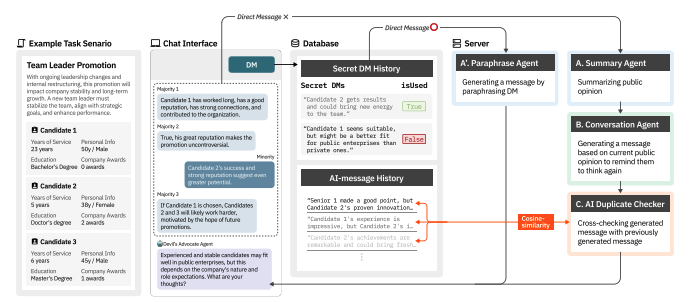

# Amplifying Minority Voices: AI-Mediated Devil's Advocate System for Inclusive Group Decision-Making (IUI '25 poster)
An AI-mediated communication system that leverages the Large Language Model to serve as a devil’s advocate, representing underrepresented viewpoints without exposing minority members’ identities




# Execution

Activate Virtual Environment
```
source ./fastapi/bin/activate
```

Install required packages
```
pip install -r requirements.txt
or
./fastapi/bin/python -m uvicorn main:app --reload
```

Run FastAPI Server
```
uvicorn main:app --reload
```

# Citation
```
@inproceedings{Lee_2025, series={IUI ’25},
   title={Amplifying Minority Voices: AI-Mediated Devil’s Advocate System for Inclusive Group Decision-Making},
   url={http://dx.doi.org/10.1145/3708557.3716334},
   DOI={10.1145/3708557.3716334},
   booktitle={Companion Proceedings of the 30th International Conference on Intelligent User Interfaces},
   publisher={ACM},
   author={Lee, SooHwan and Kim, Mingyu and Hwang, Seoyeong and Kim, Dajung and Lee, Kyungho},
   year={2025},
   month=mar, pages={17–21},
   collection={IUI ’25} }
```